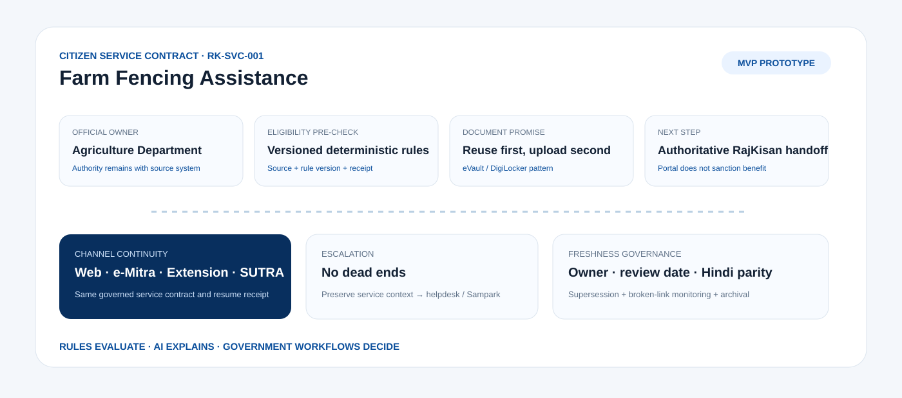
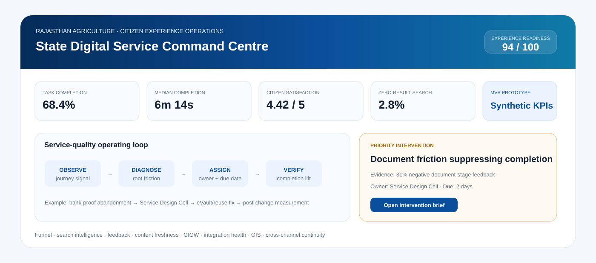

<p align="center"><strong>RAJASTHAN INNOVATION CHALLENGE 2026 · AGRICULTURE</strong></p>

# RajKisan One — Rajasthan Agriculture Digital Front Door

<p align="center"><strong>MVP PROTOTYPE · EVALUATOR BUILD · NOT A PRODUCTION GOVERNMENT SERVICE</strong></p>
<p align="center"><strong>One farmer. One front door. Every agriculture service.</strong></p>

<p align="center">
<a href="https://ric-agriculture-portal-revamp.vercel.app/"><strong>▶ OPEN LIVE MVP</strong></a> ·
<a href="docs/EVALUATOR_RUNBOOK.md">90-SECOND DEMO</a> ·
<a href="submission/STRICT_JUDGE_REVIEW.md">STRICT JUDGE</a> ·
<a href="docs/REQUIREMENTS_TRACEABILITY.md">CHALLENGE TRACEABILITY</a>
</p>

**Challenge:** Revamp of Department of Agriculture Web Portal — Citizen-Centric Digital Front-End  
**Applicant:** Syntheon Tech Private Limited  
**Live MVP:** https://ric-agriculture-portal-revamp.vercel.app/  
**Repository:** https://github.com/Sauravssoni/RIC-Agriculture-Portal-Revamp  
**Version:** `0.9.0-mvp`  
**Design principle:** modernise the citizen experience; preserve Government source authority.

<p align="center"></p>

## The thesis

Rajasthan already owns powerful digital agriculture rails: **RajKisan Saathi, RajSSO, Jan Aadhaar, Raj Sewa Dwaar, Raj eVault, RajDharaa, Jan Soochna, e-Dharti, e-Mitra and emerging AgriStack/UFSI infrastructure**. The missing opportunity is a coherent public front door for discovery, explanation, continuity, document readiness, status visibility, feedback and service-quality operations.

> **RajKisan One is not another agriculture database or another RajKisan. It is the citizen-experience, orchestration and observability layer over systems Rajasthan already owns.**

```text
EXISTING GOVERNMENT SYSTEMS
        ↓
RAJKISAN ONE
citizen experience + consent + rules + orchestration + observability
        ↓
ONE COHERENT SERVICE JOURNEY
        ↓
AUTHORITATIVE HANDOFF / STATUS / RECEIPT
```

## What makes this more than a standard portal revamp

### Citizen Service Contract
Every priority scheme/service is designed as an executable public contract rather than a static page:
- official owner and current availability;
- source/version/effective-date metadata;
- deterministic non-statutory pre-check;
- required evidence and reuse-first document plan;
- next citizen action and authoritative handoff;
- assisted-channel continuity;
- escalation path;
- content freshness / Hindi parity / archival state.

<p align="center"></p>

### Personal Action Centre
After sandbox sign-in, the farmer sees **what needs attention now**: pending verification, missing document, approaching deadline, new status and relevant services. A citizen should not need to remember which portal to revisit.

### Cross-channel continuity
The MVP creates a privacy-safe **resume receipt** so the same journey can conceptually move across self-service web/PWA → e-Mitra → extension worker → authorised SUTRA field workflow without exposing raw identity numbers.

### Department service operations
Analytics is not vanity BI. It closes a loop:

```text
OBSERVE → DIAGNOSE → ASSIGN OWNER + SLA → FIX → VERIFY IMPROVEMENT → AUDIT
```

<p align="center"></p>

## Evaluator entry points

| Surface | Route | Visible proof |
|---|---|---|
| Citizen front door | `#home` | mobile-first task navigation, bilingual UX, Action Centre, sandbox SSO |
| Services | `#services` | structured catalogue + Citizen Service Contract + explainable rule pre-check |
| My Agriculture | `#farm` | application timeline, document readiness, My Service Inbox, resume receipt |
| GIS & Service Access | `#map` | Rajasthan service-access pattern + synthetic district service health |
| Department Insights | `#analytics` | funnel, friction, search, feedback, content/GIGW and integration operations |
| DPI Integrations | `#integrations` | connector truth/authority states |
| CMS & GIGW | `#cms` | lifecycle governance + Scheme Rule Studio + phased migration |
| SUTRA Field | `#edge` | optional low-connectivity voice/evidence channel using the same service contract |

Click **Evaluator Demo** in the live MVP for a guided proof sequence.

## MVP implementation proof

### Citizen experience
- responsive Government-style desktop/mobile UI;
- Hindi/English switching;
- text size, contrast, skip link, keyboard-compatible controls and reduced-motion support;
- PWA manifest + offline shell service worker;
- task-first universal service discovery;
- functional RajSSO/Jan Aadhaar **sandbox** modal with purpose notice and no real credential collection;
- proactive Action Centre and citizen feedback receipt.

### Service intelligence
- structured service catalogue;
- clickable Citizen Service Contract;
- deterministic eligibility endpoint + rule version + decision receipt;
- explicit non-statutory boundary;
- grounded Krishi Saathi interaction pattern;
- citizen-readable application timeline;
- verified-document reuse UX;
- secure local-file demo: PDF/JPG/PNG allowlist, 5 MB limit, browser-side SHA-256, no upload in evaluator mode;
- privacy-safe cross-channel resume receipt.

### Department operations
- State Digital Service Command Centre;
- task funnel and completion trends;
- largest-friction intervention card;
- zero-result/search intelligence;
- feedback radar;
- content freshness, supersession and broken-link health;
- GIGW/accessibility readiness;
- integration health pulse;
- service-quality action queue with **signal → evidence → owner → due date → action**;
- map-linked district context.

<p align="center"></p>

## Evaluator API contracts

Deployed deterministic sandbox functions:
- `GET /api/health`
- `POST /api/eligibility`
- `POST /api/feedback`
- `GET /api/content-health`
- `GET /api/action-centre`
- `GET /api/service-search?q=tarbandi`

`/api/health` deliberately returns `authoritative_government_connection:false` in evaluator mode. No production Government credentials or citizen PII are stored in this repository.

## Rajasthan DPI strategy

| Rail | RajKisan One role | Authority remains with |
|---|---|---|
| RajKisan | transaction/status/deep-link adapter | RajKisan |
| RajSSO | citizen/official authentication | DoIT&C |
| Jan Aadhaar 2.0 | consented minimum-necessary profile attributes | Jan Aadhaar |
| Raj Sewa Dwaar | Rajasthan integration/API plane | DoIT&C/RISL |
| Raj eVault / DigiLocker | verified-document reuse | issuer/document authority |
| Jan Soochna | scheme transparency interoperability | source department |
| RajDharaa | official geography/spatial layers | RajDharaa/source departments |
| e-Dharti / Apna Khata | approved land context | Revenue authority |
| AgriStack / UFSI | future farmer/farmland service interoperability | registry authorities |
| BHASHINI | ASR/NMT/TTS accessibility | language provider only |
| IMD / AGMARKNET | freshness-labelled context | source agencies |
| e-Mitra / Sampark | assisted access / escalation | respective authorities |

## Responsible AI boundary

> **Rules evaluate. AI explains. Government workflows decide.**

AI can retrieve official content, translate, summarize, classify intent and explain a deterministic result. It cannot invent scheme policy, silently widen consent, mutate Government facts, or approve/deny statutory benefits.

## Selective reuse of proven Syntheon capability

**SUTRA-ID Edge** contributes an optional trust pattern for low-connectivity field access: `voice/evidence → AI candidate → human confirmation → signed handoff`. It is not a portal dependency.  
**FarmGraph Rakshak** contributes map-first operations, offline/PWA and connector-truth engineering patterns; crop AI never becomes entitlement authority.  
**RAJ-AGRISETU X** contributes consent/provenance and AgriStack/UFSI adapter discipline.

## 90-day joint pilot

The proposal defines an **indicative ₹48.00 lakh production-core pilot**, not a fantasy statewide rewrite:
1. baseline, content/system ownership and security plan;
2. mobile PWA + structured service catalogue + CMS adapter;
3. deterministic rule registry, document readiness and status orchestration;
4. approved Rajasthan DPI connector onboarding;
5. Krishi Saathi/BHASHINI, GIS and assisted-channel validation;
6. Department operations command centre;
7. security/VAPT, accessibility/GIGW evidence, UAT, training and statewide scale blueprint.

See [`docs/90_DAY_PILOT.md`](docs/90_DAY_PILOT.md), [`docs/JOINT_PILOT_ACCEPTANCE_SCORECARD.md`](docs/JOINT_PILOT_ACCEPTANCE_SCORECARD.md) and [`docs/FUTURE_VISION_BUSINESS_MODEL.md`](docs/FUTURE_VISION_BUSINESS_MODEL.md).

## Documentation & evidence room

- [`docs/RESEARCH_EVIDENCE.md`](docs/RESEARCH_EVIDENCE.md)
- [`docs/ARCHITECTURE.md`](docs/ARCHITECTURE.md)
- [`docs/RAJKISAN_CONTINUITY_STRATEGY.md`](docs/RAJKISAN_CONTINUITY_STRATEGY.md)
- [`docs/EVALUATOR_DIFFERENTIATION.md`](docs/EVALUATOR_DIFFERENTIATION.md)
- [`docs/REQUIREMENTS_TRACEABILITY.md`](docs/REQUIREMENTS_TRACEABILITY.md)
- [`docs/INTEGRATION_TRUTH_MATRIX.md`](docs/INTEGRATION_TRUTH_MATRIX.md)
- [`docs/SECURITY_GOVERNANCE.md`](docs/SECURITY_GOVERNANCE.md)
- [`docs/SERVICE_OBSERVABILITY_MODEL.md`](docs/SERVICE_OBSERVABILITY_MODEL.md)
- [`docs/CLAIMS_AND_PROOF.md`](docs/CLAIMS_AND_PROOF.md)
- [`docs/BUDGET_AND_RESOURCING.md`](docs/BUDGET_AND_RESOURCING.md)
- [`docs/EVALUATOR_RUNBOOK.md`](docs/EVALUATOR_RUNBOOK.md)
- [`docs/FORM_ANSWERS_FINAL.md`](docs/FORM_ANSWERS_FINAL.md)
- [`submission/STRICT_JUDGE_REVIEW.md`](submission/STRICT_JUDGE_REVIEW.md)
- [`submission/FINAL_RELEASE_GATE.md`](submission/FINAL_RELEASE_GATE.md)

## Quality gate

```bash
npm run release-check
```

## MVP prototype integrity

All farmer identities, applications, district completion rates, funnel metrics, content-health metrics and service outcomes shown in the evaluator UI are **synthetic demonstration data** unless explicitly labelled otherwise. The GIS view is illustrative, not authoritative geometry. Production use requires Department-approved content/API onboarding, official geography, credential/security review, VAPT/UAT and applicable GIGW/STQC/government-hosting approvals.
